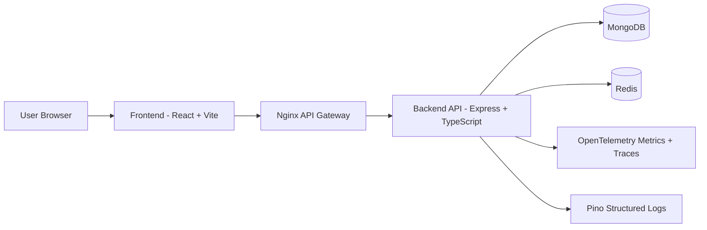

# Gateway Platform

A full-stack API gateway platform with:
- A React frontend for authentication flows, product testing, and feature pages
- A Node.js + Express backend for auth, products, caching, and rate limiting
- An Nginx gateway layer for edge routing, CORS, and request shaping
- Redis for cache and distributed rate limiting
- MongoDB for user, token, and product persistence
- OpenTelemetry + Pino for metrics, tracing, and structured logs

This repository is structured as a practical production-style system where concerns are intentionally split between edge (Nginx), application logic (Express), data services (MongoDB/Redis), and client UX (React).

## Table of Contents
- [1. High-Level Architecture](#1-high-level-architecture)
- [2. Repository Structure](#2-repository-structure)
- [3. Functional Overview](#3-functional-overview)
- [4. Backend Deep Dive](#4-backend-deep-dive)
- [5. API Gateway (Nginx) Deep Dive](#5-api-gateway-nginx-deep-dive)
- [6. Frontend Deep Dive](#6-frontend-deep-dive)
- [7. API Surface](#7-api-surface)
- [8. Security and Reliability Controls](#8-security-and-reliability-controls)
- [9. Observability](#9-observability)
- [10. Environment Variables](#10-environment-variables)
- [11. Local Development](#11-local-development)
- [12. Docker and Deployment](#12-docker-and-deployment)
- [13. Operational Notes](#13-operational-notes)
- [14. Future Improvements](#14-future-improvements)

## 1. High-Level Architecture



### Request flow summary
1. The frontend calls gateway/backend endpoints with credentials enabled.
2. Nginx handles edge concerns: CORS normalization, route-based rate limits, proxying.
3. Backend enforces app-level auth checks, strict auth throttling, and response caching for products.
4. MongoDB stores application entities. Redis powers cache and distributed rate limiting.
5. Telemetry is emitted for requests, DB timing, errors, spans, and logs.

## 2. Repository Structure

```text
Gateway/
  API-Gateway/          # Nginx edge gateway config and Docker image
  backend/              # Express TypeScript API
  frontend/             # React + Vite SPA
  docker-compose.yml    # Main app stack (frontend/backend/nginx/mongo + include redis)
  docker-compose.redis.yml
```

### Key ownership boundaries
- `API-Gateway/`: traffic entry point and edge controls
- `backend/`: business logic, auth lifecycle, product CRUD, cache invalidation
- `frontend/`: UX, route guarding, auth/session handling, API tester interface

## 3. Functional Overview

### Implemented capabilities
- User signup/login with JWT cookie-based auth
- Google OAuth login support
- Password reset workflow with token hashing, expiry, resend guardrails
- Protected profile retrieval (`/api/auth/me`)
- Product CRUD endpoints
- Read caching for product routes with stale support
- Two-layer rate limiting:
  - Nginx edge limits by path category
  - Backend Redis limits (general + strict auth)
- End-to-end observability (request metrics, db timings, traces, structured logs)
- API testing dashboard in frontend for rate limit/cache behavior inspection

## 4. Backend Deep Dive

### Tech stack
- Runtime: Node.js
- Framework: Express 5
- Language: TypeScript
- Data: MongoDB via Mongoose
- Cache and limits: Redis (ioredis + rate-limiter-flexible)
- Auth: JWT + HTTP-only cookies
- OAuth: Google token verification
- Email: Resend
- Observability: OpenTelemetry + Pino

### Boot process (`backend/src/server.ts`)
- Loads environment variables via `dotenv`
- Enables `trust proxy` for correct client IP evaluation behind reverse proxies
- Registers HTTP instrumentation middleware early
- Parses JSON and cookies
- Applies general API limiter to non-health/non-root paths
- Exposes `/health` endpoint with Redis health probe
- Mounts route groups:
  - `/api/auth` for auth workflows
  - `/api/products` with cache middleware
  - `/api` for refresh endpoint
- Installs centralized error handler
- Registers graceful shutdown hooks for HTTP server + Redis close

### Authentication and session model

#### Token model
- Access token: short-lived JWT (`15m`)
- Refresh token: long-lived JWT (`7d`)
- Both are set as secure, httpOnly cookies with `sameSite=none`

#### Auth features
- **Signup**
  - Validates required fields
  - Rejects duplicate email
  - Hashes password with bcrypt
  - Creates user and sets access/refresh cookies
- **Login**
  - Validates credentials
  - Handles local vs Google-only accounts
  - Verifies bcrypt hash
  - Issues cookies
- **Google login**
  - Verifies Google ID token against configured client ID
  - Creates or links account
  - Issues cookies and user payload
- **Get current user (`/me`)**
  - Protected by middleware reading `accessToken` cookie
  - Fetches user from DB by decoded `userId`

### Password reset workflow
- `forgot-password`:
  - Validates user email
  - Applies cooldown if password was recently changed
  - Generates secure random token
  - Stores hashed token in `ResetToken` collection
  - Sends reset email asynchronously
- `reset-password`:
  - Validates token + password + confirmation
  - Verifies hashed token and expiry
  - Hashes new password and updates user
  - Deletes existing reset tokens
- `resend`:
  - Ensures a previous reset request exists
  - Enforces resend count and resend cooldown
  - Rotates token and re-sends email

### Product module
- `GET /all`: fetches all products
- `GET /:productId`: fetches single product
- `POST /create`: creates product
- `PUT /update/:productId`: full update by provided fields
- `PATCH /update/:productId`: selective field update for allowed fields
- `DELETE /delete/:productId`: deletes product

Every write operation triggers product resource cache invalidation in Redis.

### Data models
- `User`
  - `name`, `email`, optional `password`, optional `googleId`, `authProvider[]`, `passwordResetAt`
- `ResetToken`
  - `userId`, `token` (hashed), `expiresAt`, `resendCount`, `lastSeenAt`
- `Product`
  - `name`, `description`, `price`, `category`

### Backend middleware strategy
- `authMiddleware`: validates access JWT from cookies and injects authenticated user id
- `apiLimiter`: general per-identifier request limits
- `authLimiter`: strict limits for sensitive auth endpoints
- `cacheMiddleware`: GET-only caching with stale serving and async invalidation
- `errorHandler`: consistent 500 error envelope + trace id logging

## 5. API Gateway (Nginx) Deep Dive

Nginx acts as edge control plane, not only as a reverse proxy.

### Responsibilities
- Route traffic by path category (`/api/auth`, `/api/products`, fallback `/api`)
- Normalize CORS responses at the edge
- Strip backend CORS headers to avoid duplicate/mixed policies
- Enforce edge-level request and connection limits
- Handle preflight (`OPTIONS`) quickly with `204`
- Expose health endpoint and guarded metrics endpoint

### Included configs
- `includes/rate-limit-zones.conf`: request and connection zones
- `includes/proxy.conf`: forwarding headers and timeouts
- `includes/caching.conf`: cache zone definition
- `includes/health.conf`: `/health` gateway check
- `includes/metrics.conf`: `stub_status` endpoint with network restrictions

### Gateway route policy
- `/api/auth/`: tighter request burst/limits for auth abuse resistance
- `/api/products/`: broader limits for data access while still controlled
- `/api/`: fallback route with consistent CORS and forwarding behavior
- The gateway injects `X-Gateway-Secret` on every proxied request, and the backend rejects any request that does not include it.

## 6. Frontend Deep Dive

### Tech stack
- React 19 + TypeScript + Vite
- React Router for navigation
- Axios for API client
- Google OAuth provider integration
- Framer Motion for interaction polish
- Mantine + Tailwind utility setup present in dependencies/config

### App routing
- `/`: landing page
- `/features`: feature marketing page
- `/login`: sign in flow
- `/signup`: registration flow
- `/reset-password`: reset link target
- `/home`: protected area containing API tester
- `*`: not-found route

### Auth state management
- `AuthContext` initializes by requesting `/api/auth/me`
- Maintains:
  - `user`
  - `isAuthenticated`
  - `loading`
- `ProtectedRoute` blocks protected pages until auth check completes

### API client behavior
- Base URL points to deployed gateway
- `withCredentials=true` for cookie transport
- Timeout configured to avoid hanging requests
- Interceptor strategy:
  - On non-auth-route `401`, attempts refresh via `/api/refresh`
  - Queues concurrent failed requests during token refresh
  - Replays original request after refresh success
  - Redirects to login when refresh fails

### User-facing functionality
- Local login/signup forms with client-side validation
- Password strength and confirmation checks for signup/reset
- Forgot-password trigger from login screen with resend timer
- Google one-click sign-in button

### API Tester module
The home page exposes an API testing interface with:
- Method/url/body controls
- Concurrency and load controls
- Real-time request logs and status buckets
- Cache/rate-limit oriented feedback and filtering

This makes the project both an application and a learning/testing surface for gateway behavior.

## 7. API Surface

### Auth routes
- `POST /api/auth/signup`
- `POST /api/auth/login`
- `POST /api/auth/google-login`
- `POST /api/auth/forgot-password`
- `POST /api/auth/reset-password`
- `POST /api/auth/resend`
- `GET /api/auth/me` (protected)

### Token refresh
- `POST /api/refresh`

### Product routes
- `GET /api/products/all`
- `GET /api/products/:productId`
- `POST /api/products/create`
- `PUT /api/products/update/:productId`
- `PATCH /api/products/update/:productId`
- `DELETE /api/products/delete/:productId`

## 8. Security and Reliability Controls

### Security controls in place
- HttpOnly secure cookies for token storage
- Distinct access/refresh token lifetimes
- Strict auth endpoint throttling
- Password hashing via bcrypt
- Reset token hashing via SHA-256
- Email/token expiry and resend guards
- Edge and app-layer rate limits

### Reliability controls in place
- Redis health checks
- Graceful shutdown of server and Redis
- Fail-open behavior for rate limit/cache middleware when Redis has transient errors
- Request timeout settings at proxy and API client layers

## 9. Observability

### Metrics
- HTTP request count, latency, and error counters
- Active connections
- DB query duration histogram
- Cache hit/miss counters

### Tracing
- Request spans from HTTP middleware
- Custom spans for auth/product workflows
- DB operation spans through query tracer wrapper

### Logging
- Structured Pino logs
- Context-rich events (attempt/success/failure patterns)
- Optional Loki stream integration

## 10. Environment Variables

Below are the variables referenced by source code.

### Backend required core
- `PORT` (default `5000`)
- `NODE_ENV`
- `MONGODB_URI`
- `ACCESS_TOKEN_SECRET`
- `REFRESH_TOKEN_SECRET`
- `TRUST_PROXY`

### Backend Redis
- `REDIS_URL`
- or Upstash fallback set:
  - `UPSTASH_REDIS_REST_URL`
  - `REDIS_REST_TOKEN` (or `UPSTASH_REDIS_REST_TOKEN`)
  - optional `UPSTASH_REDIS_PORT`
- Optional cache tuning:
  - `CACHE_STALE_SECONDS`
  - `CACHE_TTL_JITTER_SECONDS`
  - `CACHE_SCAN_COUNT`

### Backend OAuth + email
- `GOOGLE_CLIENT_ID`
- `RESEND_API_KEY`
- `EMAIL_FROM`

### Backend observability optional
- `GRAFANA_OTLP_ENDPOINT`
- `OPTL_INSTANCE_ID`
- `GRAFANA_API_TOKEN`
- `SERVICE_NAME`
- `SERVICE_VERSION`
- `GRAFANA_LOKI_URL`
- `LOKI_INSTANCE_ID`
- `LOG_LEVEL`

### Frontend
- `VITE_GOOGLE_CLIENT_ID`

## 11. Local Development

### Option A: Run services directly

1. Start dependencies (Mongo + Redis):
```bash
docker compose -f docker-compose.redis.yml up -d
```

2. Backend:
```bash
cd backend
npm install
npm run dev
```

3. Frontend:
```bash
cd frontend
npm install
npm run dev
```

4. Optional gateway (Nginx) for edge behavior testing:
```bash
docker compose up nginx
```

### Option B: Docker compose stack

From repository root:
```bash
docker compose up --build
```

This brings up frontend, backend, mongo, nginx, and included redis services.

## 12. Docker and Deployment

### Backend Dockerfile
- Multi-stage build
- Compiles TypeScript in build stage
- Runs `dist/server.js` in runtime stage

### Frontend Dockerfile
- Builds Vite assets in Node stage
- Serves static output through Nginx

### Gateway Dockerfile
- Packages custom Nginx config and include route files

### Deployment model currently reflected in code
- Frontend API client points to hosted gateway URL
- Gateway routes proxy to hosted backend URL
- Vercel rewrite config supports SPA routing

## 13. Operational Notes

### Cache semantics
- GET only
- HIT/MISS/STALE signaling in response headers
- Resource-level invalidation after product mutations
- Cache-Control headers applied to support diagnostics and freshness behavior

### Rate-limit semantics
- Edge and app-level limits work together
- Auth endpoints are intentionally more strict
- Rate-limit response metadata is returned via headers and retry windows

### Health checks
- Backend `/health` validates Redis connectivity
- Gateway `/health` provides edge-level liveness response

### Important implementation notes
- Password reset email recipient is currently hardcoded in auth controller for testing; production should send to requested user email.
- DB tracing helper currently labels `db.system` as `postgresql` while this project uses MongoDB; update this attribute for telemetry correctness.
- Cookies are configured as `secure` and `sameSite=none`; local non-HTTPS testing may require environment-specific cookie handling.

