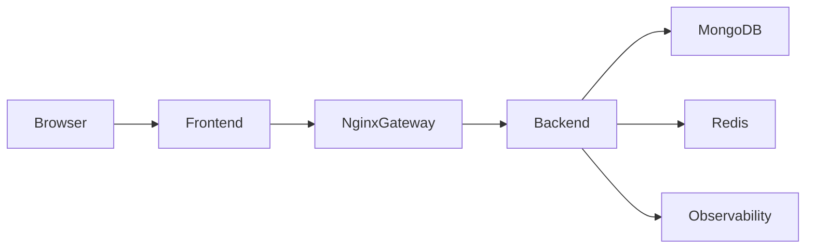

# Gateway Platform

Production-style full-stack gateway system with:
- React + Vite frontend
- Express + TypeScript backend
- Nginx edge gateway
- MongoDB persistence
- Redis distributed cache + rate limiting
- Cookie-based auth with refresh + CSRF protection
- Observability via OpenTelemetry + structured logging

## 1. Current Highlights

Recent updates now included:
- Access and refresh tokens are both cookie-based (no localStorage tokens).
- Refresh endpoint (`POST /api/refresh`) issues a fresh access token and CSRF token.
- CSRF protection on unsafe methods, with explicit exemptions for auth bootstrap routes.
- Frontend retries once on `401` or CSRF `403` by calling refresh and replaying the original request.
- Auth bootstrap on app load using refresh + profile fetch.
- Logout no longer force-redirects to login; unauthenticated users are redirected when protected api tester route is accessed.
- Protected route is `/api-tester` (with `/home` compatibility redirect).
- Full automated testing setup for backend and frontend with pass/fail coverage.

## 2. Architecture



## 3. Repository Structure

```text
Gateway/
  API-Gateway/
    nginx/
  backend/
    src/
      auth/
      middleware/
      products/
      tests/
  frontend/
    src/
      components/
      context/
      hooks/
      pages/
      services/
      utils/
  docker-compose.yml
  docker-compose.redis.yml
  TESTING.md
```

## 4. Auth and Security Model

### Token Model
- Access token: short-lived JWT (cookie, httpOnly).
- Refresh token: long-lived JWT (cookie, httpOnly).
- CSRF token: cookie + request header validation for unsafe methods.

### CSRF Protection
Protected methods:
- `POST`, `PUT`, `PATCH`, `DELETE`

Exempt routes:
- `POST /auth/signup`
- `POST /auth/login`
- `POST /auth/google-login`
- `POST /auth/forgot-password`
- `POST /auth/reset-password`
- `POST /auth/resend`
- `POST /auth/logout`
- `POST /refresh`

### Refresh Behavior
- `POST /api/refresh`:
  - `401` when refresh token cookie is missing.
  - `403` when refresh token is invalid or expired.
  - On success, rotates auth cookies and returns a fresh CSRF token.

### Frontend Retry Behavior
- On `401` or CSRF `403`, frontend retries once:
  1. Calls `/api/refresh`
  2. Replays original request
- If refresh fails, clears auth state and redirects only when protected route access requires auth.

## 5. Frontend Routes

- `/` landing page
- `/features` features page
- `/login` login page
- `/signup` signup page
- `/reset-password` reset flow page
- `/api-tester` protected dashboard/tester page
- `/home` compatibility redirect to `/api-tester`
- `*` not found

## 6. Core Backend API Surface

### Auth
- `POST /api/auth/signup`
- `POST /api/auth/login`
- `POST /api/auth/google-login`
- `POST /api/auth/logout`
- `GET /api/auth/me`
- `POST /api/auth/forgot-password`
- `POST /api/auth/reset-password`
- `POST /api/auth/resend`

### Session
- `POST /api/refresh`

### Products
- `GET /api/products/all`
- `GET /api/products/:productId`
- `POST /api/products/create`
- `PUT /api/products/update/:productId`
- `PATCH /api/products/update/:productId`
- `DELETE /api/products/delete/:productId`

## 7. Local Development

## Prerequisites
- Node.js 20+
- npm 10+
- Docker (recommended for infra)

## Start services (recommended)

```bash
docker compose up -d
```

## Backend (local)

```bash
cd backend
npm install
npm run dev
```

## Frontend (local)

```bash
cd frontend
npm install
npm run dev
```

## 8. Environment Notes

Configure backend environment with at least:
- `ACCESS_TOKEN_SECRET`
- `REFRESH_TOKEN_SECRET`
- `MONGO_URI` or equivalent DB settings
- Redis connection values (if enabled)
- CORS and cookie settings for deployment

Cookie/security-related settings:
- `COOKIE_SECURE`
- `COOKIE_SAME_SITE`
- `COOKIE_DOMAIN`

## 9. Testing

Automated testing is now configured in both apps.

### Backend

```bash
cd backend
npm run test
npm run test:watch
npm run test:coverage
```

### Frontend

```bash
cd frontend
npm run test
npm run test:watch
npm run test:coverage
```

See full test plan and manual verification steps in [TESTING.md](TESTING.md).

## 10. What Is Covered by Tests

Backend test coverage includes:
- CSRF middleware positive/negative behavior
- Cookie options setup/clear behavior
- JWT token generation success/failure
- Refresh controller success and failure modes (`401`/`403`)
- Gateway-only middleware allow/deny logic
- CSRF integration flow using Express + Supertest

Frontend test coverage includes:
- Login/signup schema validation success/failure
- Password strength utility
- Metrics parser utility
- Protected route behavior (loading, authenticated, unauthenticated)
- Load tester hook success/failure logging

## 11. Deployment Notes

- Keep API traffic routed through Nginx gateway.
- Ensure secure cookie settings in production (HTTPS required).
- Validate CORS allowlist and gateway secret consistency.
- Run tests + coverage before release.

## 12. Additional Docs

- [TESTING.md](TESTING.md)
- [DISTRIBUTED-CACHE-RATELIMIT-SETUP.md](DISTRIBUTED-CACHE-RATELIMIT-SETUP.md)
- [QUICK-VERIFICATION.md](QUICK-VERIFICATION.md)
- [IMPLEMENTATION-SUMMARY.md](IMPLEMENTATION-SUMMARY.md)

